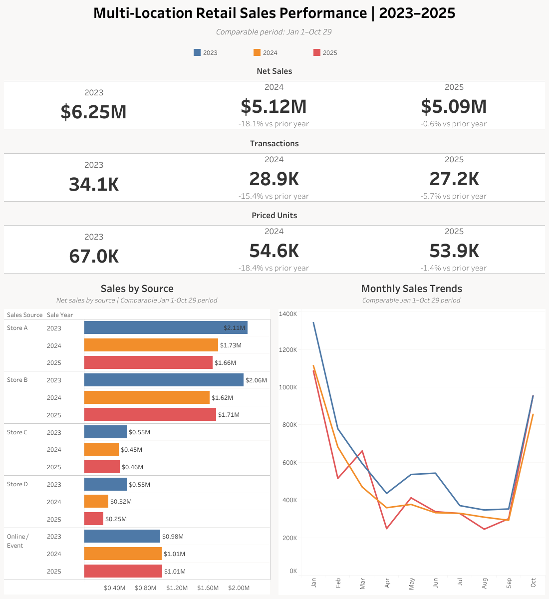
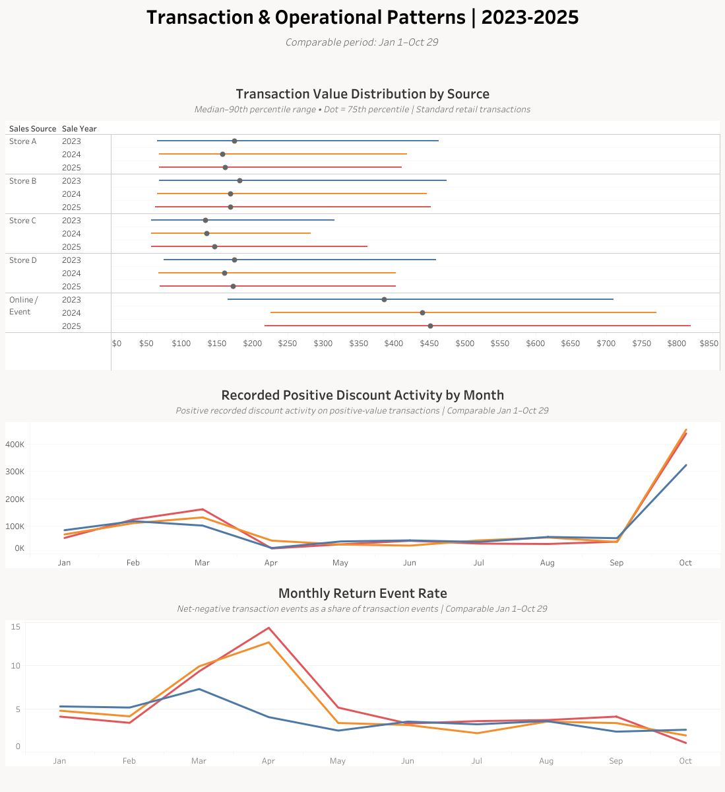

# Multi-Location Retail Sales Analysis

An end-to-end analysis of anonymized multi-location retail sales data from 2023–2025 using **BigQuery** for data cleaning, privacy transformation, validation, and analysis, with **Tableau** dashboards for performance, seasonality, transaction behaviour, discounts, and returns.

> **Data privacy:** This project uses real business data with permission. The retailer, locations, transaction identifiers, internal codes, and other identifying information have been anonymized. Raw datasets are not included in this repository.

---

## Project Overview

This project analyzes transaction-level sales data from a multi-location specialty retailer operating four physical stores alongside a combined **Online / Event** sales source.

The original data was exported from a live retail system and required substantial preparation before it was suitable for analysis. The project therefore includes the full analytical workflow:

1. Data cleaning and transaction validation
2. Privacy review and anonymization
3. Creation of portfolio-safe analytical tables
4. Validation of transformed data
5. Exploratory and business-focused SQL analysis
6. Tableau visualization and dashboard development

The available data covers:

- **2023:** full calendar year
- **2024:** full calendar year
- **2025:** January 1 through October 29

Because November and December are meaningful seasonal selling months, most direct three-year comparisons use a common **January 1–October 29** period.

---

## Business Questions

The analysis was organized around five questions:

### 1. How did overall business performance change across the three years?

I compared transaction volume, priced unit volume, net sales, and average transaction value using equivalent calendar periods.

### 2. How did performance differ by sales source?

I examined the contribution and trajectory of four anonymized physical stores and the combined Online / Event source.

### 3. Did customer transaction behaviour change?

I separated:

- priced basket quantity
- transaction complexity
- transaction value
- upper-end basket behaviour

This prevented zero-value service or operational lines from being mistaken for additional purchased merchandise.

### 4. How seasonal was the business?

I used both:

- January 1–October 29 for three-year comparisons
- full-year 2023–2024 data to preserve November and December seasonality

### 5. How did discount and return activity change?

Recorded positive discount activity and net-negative return transactions were analyzed separately to avoid combining fundamentally different transaction behaviours.

---

## Tools

- **Google BigQuery** — SQL cleaning, transformation, validation, privacy auditing, and analysis
- **Tableau Public** — dashboard development and visualization
- **Google Sheets / CSV** — intermediate output review
- **GitHub** — project documentation and reproducible SQL

---

## Data Preparation

The source data contained retail Sale Line records rather than one row per transaction.

Key preparation steps included:

- filtering to valid Sale Line records
- excluding voided receipts
- validating negative quantities and amounts as legitimate return activity
- retaining legitimate zero-value operational and service lines
- standardizing schemas across years
- validating transaction-event grain
- auditing descriptive fields for identifying information
- replacing private store and source codes with anonymous labels
- replacing identifying SKU values with generic equivalents
- replacing original receipt numbers with anonymous transaction IDs
- validating transformed annual datasets against expected row and transaction counts

The final portfolio tables preserve analytical value while removing known identifying business information.

---

## Important Metric Definitions

### Transaction Event

A transaction event represents one validated receipt-level transaction.

### Priced Net Units

```sql
SUM(
  CASE
    WHEN subtotal != 0 THEN quantity
    ELSE 0
  END
)
```

The source data contains legitimate zero-value components, services, and operational lines that can carry quantity.

For that reason, **priced net units** are used as the primary merchandise-unit metric rather than raw summed quantity.

### Online / Event

`Online / Event` is a combined source containing both ordinary online transactions and special-event activity.

It should **not** be interpreted as an ecommerce-only channel.

### Return Event

For the dedicated return analysis, a return event is defined as a transaction whose summed net sales value is negative.

Mixed transactions containing a return but remaining net-positive are not classified as full return events.

### Positive Discount Activity

Discount analysis is limited to positive-value transactions where the transaction-level recorded discount is greater than zero.

The discount field is treated as **recorded discount activity**, not as a conventional discount-rate KPI or direct measure of pricing strategy.

---

## Key Findings

### 1. The largest business decline occurred between 2023 and 2024

For the comparable January 1–October 29 period:

| Metric | 2023 | 2024 | 2025 |
|---|---:|---:|---:|
| Transaction events | 34,137 | 28,887 | 27,233 |
| Priced net units | 66,999 | 54,646 | 53,896 |
| Net sales | $6.25M | $5.12M | $5.09M |
| Avg. sales / transaction | $183.18 | $177.24 | $186.86 |

From 2023 to 2024:

- transaction events declined **15.4%**
- priced net units declined **18.4%**
- net sales declined **18.1%**
- average transaction value declined **3.2%**

From 2024 to 2025, performance was substantially more stable:

- transaction events declined **5.7%**
- priced net units declined **1.4%**
- net sales declined only **0.6%**
- average transaction value increased **5.4%**

2025 therefore generated nearly the same sales as 2024 despite fewer transactions.

---

### 2. Sales-source performance varied substantially

The retailer-wide trend was not shared evenly across locations.

Some sources remained comparatively stable while others experienced much larger changes in transaction volume and sales.

Online / Event consistently produced higher average transaction values than the physical-store sources, but that behaviour was influenced by the source's mixed online and event activity.

Store-level performance therefore needed to be evaluated separately rather than inferred from the retailer-wide totals.

---

### 3. Typical physical-store baskets remained small

Across the physical stores, a typical transaction generally contained:

- **1 Sale Line**
- **1 distinct SKU**
- **1 priced unit**

Upper-end basket behaviour changed in some locations, but the data did not show a universal shift toward larger baskets.

Online / Event transactions became progressively higher-value without a corresponding broad increase in priced-unit quantity.

Stores C and D showed more evidence of increased upper-end basket size in 2025, while Store B remained comparatively stable.

This demonstrated why transaction value, priced basket quantity, and transaction complexity should be analyzed separately.

---

### 4. The business has a strong seasonal cycle

Full-year 2023 and 2024 data show:

- strong winter performance
- lower spring and summer activity
- substantial year-end acceleration

December was the highest-sales month in both complete years:

- **2023:** $1.50M
- **2024:** $1.61M

The 2024 decline was broad: every comparable month from January through October recorded both fewer transactions and lower sales than the same month in 2023.

However, December 2024 recovered to almost exactly the prior-year transaction volume:

- December 2023: **6,432 transactions**
- December 2024: **6,428 transactions**

while net sales increased from **$1.50M to $1.61M**.

2025 was much less uniform. Several months produced similar or higher sales despite lower transaction counts, while other months remained materially weaker.

---

### 5. Online / Event contains a highly concentrated annual event period

October Online / Event activity was overwhelmingly concentrated within two dates each year.

Using an equivalent October 1–29 comparison period, the two highest-volume dates represented:

| Year | Share of October Transactions | Share of October Sales |
|---|---:|---:|
| 2023 | 96.21% | 97.90% |
| 2024 | 95.15% | 95.72% |
| 2025 | 98.17% | 98.43% |

Business context confirms that these dates align with a known annual event period.

Because ordinary online transactions share the same source category, the analysis does not attribute every transaction on those dates exclusively to the event.

---

### 6. Discount frequency was stable, while recorded discount dollars were concentrated around the October annual event.

The percentage of positive-value transactions with positive recorded discount activity remained relatively stable:

- **2023:** 25.79%
- **2024:** 24.43%
- **2025:** 25.92%

However, positive recorded discount totals increased from approximately:

- **$910K in 2023**
- **$1.03M in 2024**
- **$1.00M in 2025**

A monthly breakdown showed that much of this difference was concentrated in October, which includes the retailer's known annual event period.

Online / Event accounted for the majority of October positive recorded discount dollars:

- **2023:** 84.13%
- **2024:** 91.60%
- **2025:** 88.01%

Because Online / Event also contains ordinary online transactions, the analysis does not attribute all October discount activity exclusively to the event. The concentration is instead interpreted as activity occurring around a known event period.

January–September positive discount totals were much more stable:

- **2023:** $586K
- **2024:** $580K
- **2025:** $566K

This substantially changed the interpretation of the annual discount totals: the apparent increase was not a broad rise across routine selling months, but was heavily concentrated around the October event period.

---

### 7. Return behaviour differed sharply by source

Net-negative transaction rates showed materially different trends across sales sources.

Online / Event declined from:

**9.80% → 7.30% → 4.83%**

while Store C increased from:

**2.83% → 7.35% → 9.70%**

Stores A and B were comparatively stable, while Store D increased in 2024 before declining somewhat in 2025.

Return activity was also seasonal, with particularly high rates during March and April.

The data identifies these patterns but does not contain enough information to establish their operational, product, or customer-level causes.

---

## Tableau Dashboards

### Performance Overview



This dashboard focuses on:

- three-year comparable-period performance
- sales-source contribution
- transaction volume
- net sales
- priced unit volume
- monthly sales trends

---

### Transaction & Operational Patterns



This dashboard focuses on:

- transaction behaviour
- basket patterns
- source differences
- discount activity
- return behaviour

---

### Interactive Dashboards

**Tableau Public:**  
[View the interactive dashboards](https://public.tableau.com/app/profile/chloe.watson2936/viz/Multi-LocationRetailSalesPerformance2023-2025_17913091308170/PerformanceOverview)

---

## Repository Structure

```text
multi-location-retail-sales-analysis/
│
├── README.md
│
├── sql/
│   │
│   ├── 01_data_cleaning/
│   ├── 02_data_privacy/
│   ├── 03_portfolio_tables/
│   ├── 04_validation/
│   ├── 05_analysis/
│   │   ├── 01_three_year_overview.sql
│   │   ├── 02_sales_source_performance.sql
│   │   ├── 03_transaction_composition.sql
│   │   ├── 04_seasonality_monthly_performance.sql
│   │   └── 05_discount_return_patterns.sql
│   │
│   └── 06_visualization_data/
│
├── outputs/
│   ├── 01_performance_overview.csv
│   ├── 02_sales_source_performance.csv
│   ├── 03_monthly_sales_trends.csv
│   ├── 04_basket_behaviour.csv
│   └── 05_discount_activity.csv
│
└── visuals/
    ├── performance_overview.png
    └── transaction_operational_patterns.png
```

---

## Analysis Workflow

The public repository follows the analytical pipeline used during the project:

```text
RAW DATA
   ↓
DATA CLEANING
   ↓
DATA PRIVACY
   ↓
PORTFOLIO-SAFE TABLES
   ↓
VALIDATION
   ↓
ANALYSIS
   ↓
VISUALIZATION DATA
   ↓
TABLEAU
```

Each stage is documented separately so that cleaning decisions, privacy decisions, analytical definitions, and business conclusions remain distinct.

---

## Privacy & Data Availability

The underlying dataset belongs to a real retailer and is used with permission under privacy constraints.

For that reason:

- raw datasets are **not included**
- the retailer's identity is withheld
- store names and locations are anonymized
- original receipt identifiers are removed
- internal source codes are removed
- identifying SKU values are replaced
- customer-specific and identifying free text is removed or generalized
- the private event name is not disclosed

Public-facing analysis and visualization SQL queries operates on anonymized portfolio tables. Cleaning and privacy SQL is included as a sanitized record of the methodology; raw data and private mapping literals are not published.

The repository is therefore intended to demonstrate the **analytical process, SQL methodology, privacy work, and findings**, rather than distribute the underlying commercial dataset.

---

## Limitations

Several limitations affect interpretation:

- 2025 data ends on **October 29**, so direct three-year comparisons use equivalent calendar periods.
- Online and special-event activity share one source category and cannot be fully separated from the available data.
- Recorded discount values may reflect multiple operational behaviours and should not be interpreted as a conventional discount rate.
- Net-negative transactions provide a practical return-event definition but do not capture every mixed transaction containing returned merchandise.
- Sales data alone cannot establish the causes of source-level or seasonal changes.
- Product, customer, marketing, purchasing, inventory-receipt, and supplier data are outside the scope of this analysis.

---

## What This Project Demonstrates

This project was designed to demonstrate more than writing SQL queries.

It shows an end-to-end analytical workflow involving:

- translating messy operational data into usable analytical tables
- investigating ambiguous fields before defining metrics
- distinguishing transaction grain from line-item grain
- identifying when a standard metric would produce a misleading result
- validating calculations across multiple analytical layers
- handling incomplete time periods appropriately
- preserving useful business context without overstating causality
- protecting private business information
- building reproducible BigQuery analysis
- translating SQL findings into Tableau dashboards
- communicating business conclusions clearly and cautiously

The central lesson throughout the project was that **the definition of a metric is part of the analysis**.

A technically correct calculation can still produce the wrong business interpretation if the transaction population, data grain, time window, or operational context is not understood first.